## Sociogéographie des électorats FN


<p></p>
<p></p><p></p><p>
Joël Gombin (CURAPP-UPJV / CHERPA-IEP Aix)
</p>


# Variables lourdes

## Des variables lourdes qui résistent

- un vote de classe, dans un contexte de redéfinition des oppositions de classe
- le poids du diplôme, révélateur des opportunités différentielles dans l'économie mondialisée

## Vote FN par CSP 

```{r, echo = FALSE, out.height='78%', fig.align='center'}
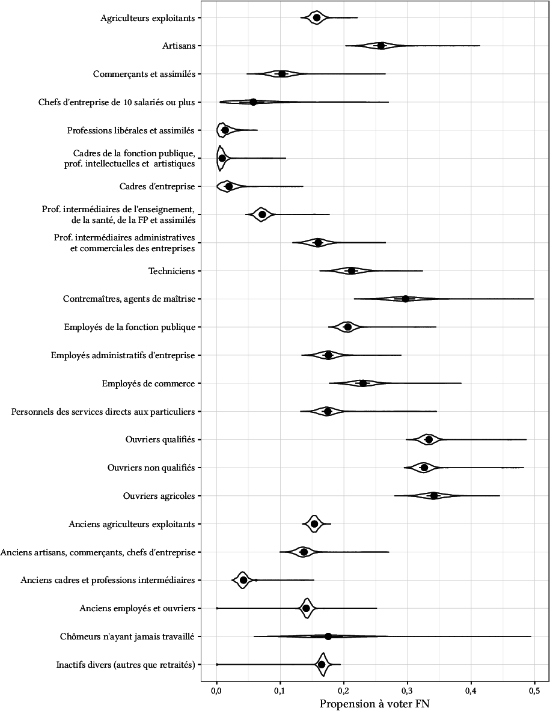
```

## Un rééquilibrage ?

```{r, echo = FALSE, out.height='90%', fig.align='center'}
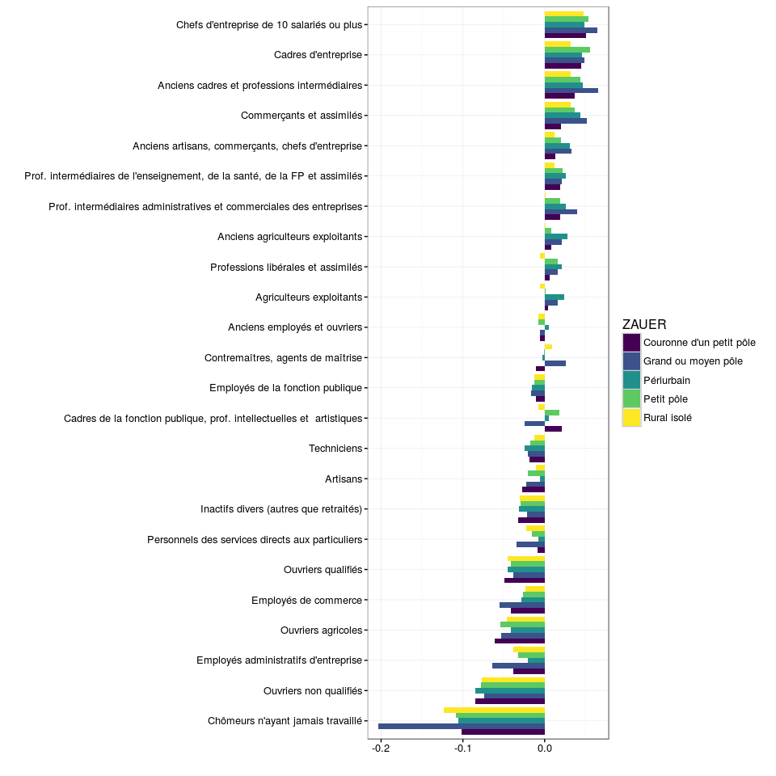
```

<p class="note">Évolution de la propension au vote FN entre 2012 (T1 prés.) et 2015 (T1 rég.)</p>

## Le poids du diplôme

Vote MLP en 2012 :

- Niveau d'étude "primaire supérieur" : 27 % 
- Diplôme supérieur à bac+2 : 7 %

À interpréter en termes d'opportunités professionnelles et sociales, et non (uniquement) cognitifs

<p class="note"> Voir Mayer (2015)</p>

## La variable religieuse

- Le noyau dur des catholiques pratiquants vote moins pour le FN (en 2012 : 13 % contre 20 % pour sans religion)
- Référence catholique identitaire => redéfinition du clivage


## Position sociale, valeurs et enjeux

```{r, echo = FALSE, out.height='70%', fig.align='center'}
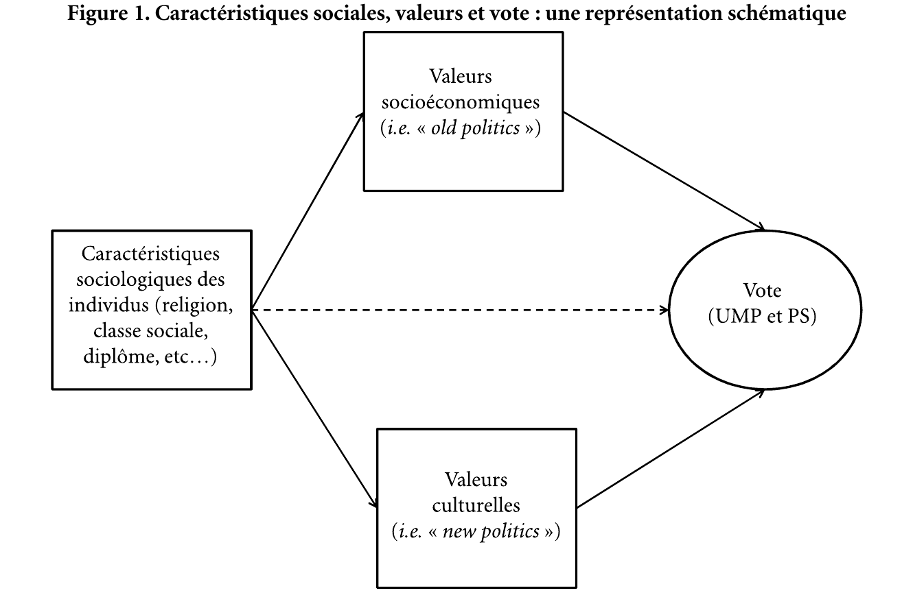
```

<p class="note">Vincent Tiberj, « La politique des deux axes. Variables sociologiques, valeurs et votes en France (1988-2007) », _Revue française de science politique_, 2012, vol. 62, nᵒ 1, pp. 71‑106.</p>


## Position sociale, valeurs et enjeux

```{r, echo = FALSE, out.height='100%', fig.align='center'}
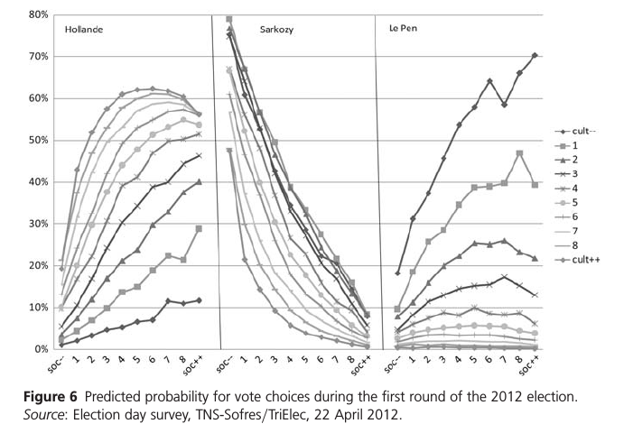
```

<p class="note">Vincent Tiberj, « Values and the Votes from Mitterrand to Hollande: The Rise of the Two-axis Politics », _Parliamentary Affairs_, 10 décembre 2012, vol. 66, nᵒ 1, pp. 69‑86.</p>


# Variabilité spatiale


## Une variabilité spatiale non-négligeable

```{r, echo = FALSE, out.width='60%', fig.align='center'}
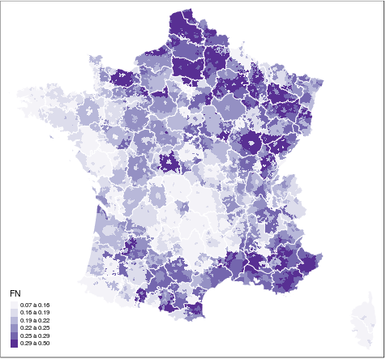
```

<p class="note">Ouvriers non qualifiés, rég. 2015</p>

## Une variabilité spatiale non-négligeable

```{r, echo = FALSE, out.width='60%', fig.align='center'}
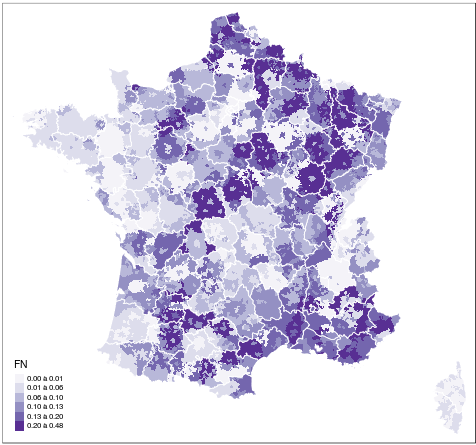
```

<p class="note">Cadres du privé, rég. 2015</p>

## Une variabilité spatiale peu liée au clivage centre/périphérie

```{r, echo = FALSE, out.width='90%', fig.align='center'}
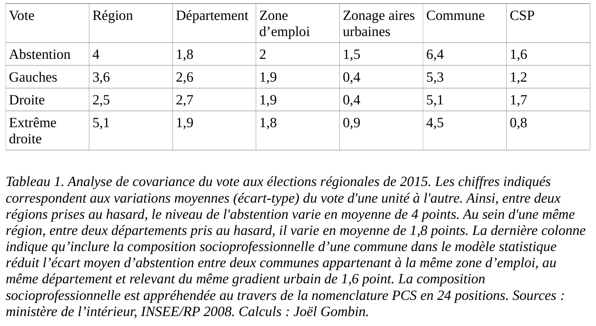
```

## Un clivage centre/périphérie qui se réduit

```{r, echo = FALSE, out.width='55%', fig.align='center'}
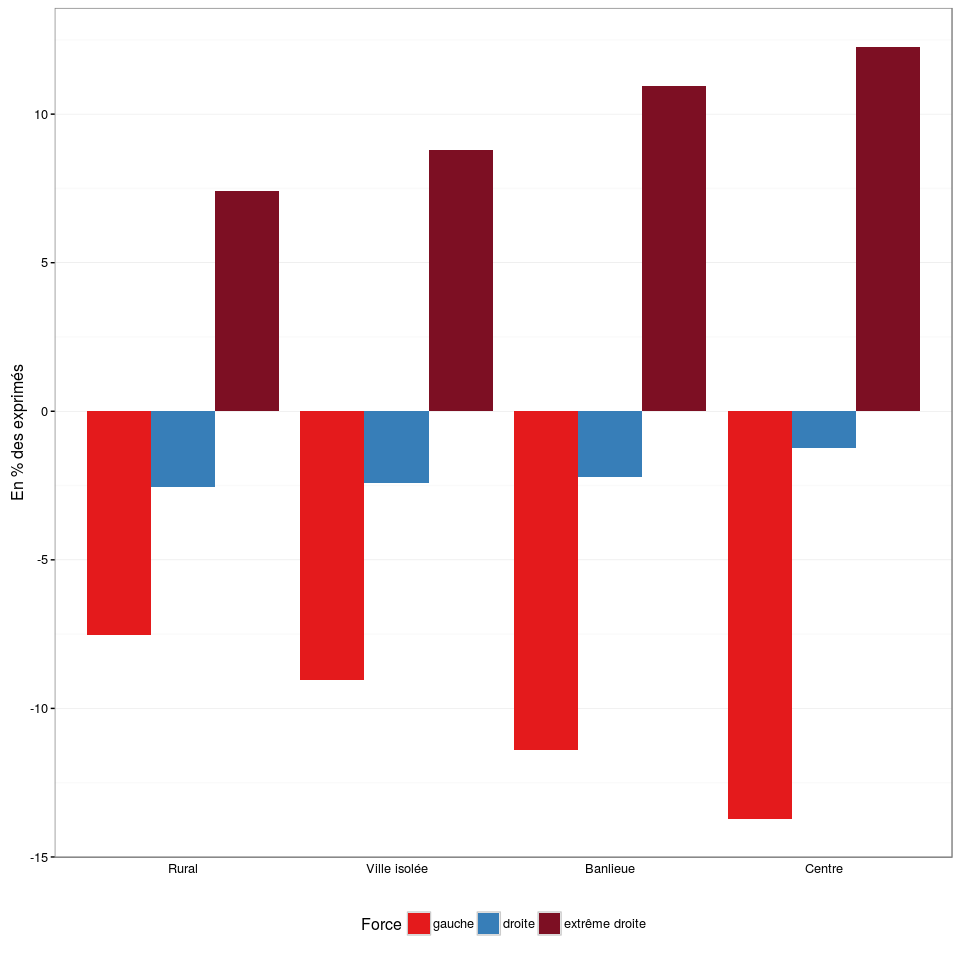
```

<p class="note">Évolution en % des exprimés entre le premier tour de la présidentielle de 2012 et le premier tour des régionales de 2015</p>


# Contextes

## L'importance des facteurs contextuels

On ne peut réduire les déterminants du vote FN à des facteurs individuels

- ethnicité
- inégalités
- offre de services et commerces de proximité
- formes du bâti
- ...

## L'environnement ethnique

```{r, echo = FALSE, out.width='80%', fig.align='center'}
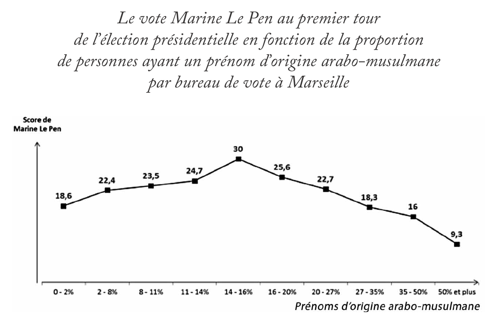
```

<p class="note">Fourquet, *Karim vote à gauche, son voisin vote FN* (2015)</p>

## Les inégalités de revenu 

```{r, echo = FALSE, out.width='60%', fig.align='center'}
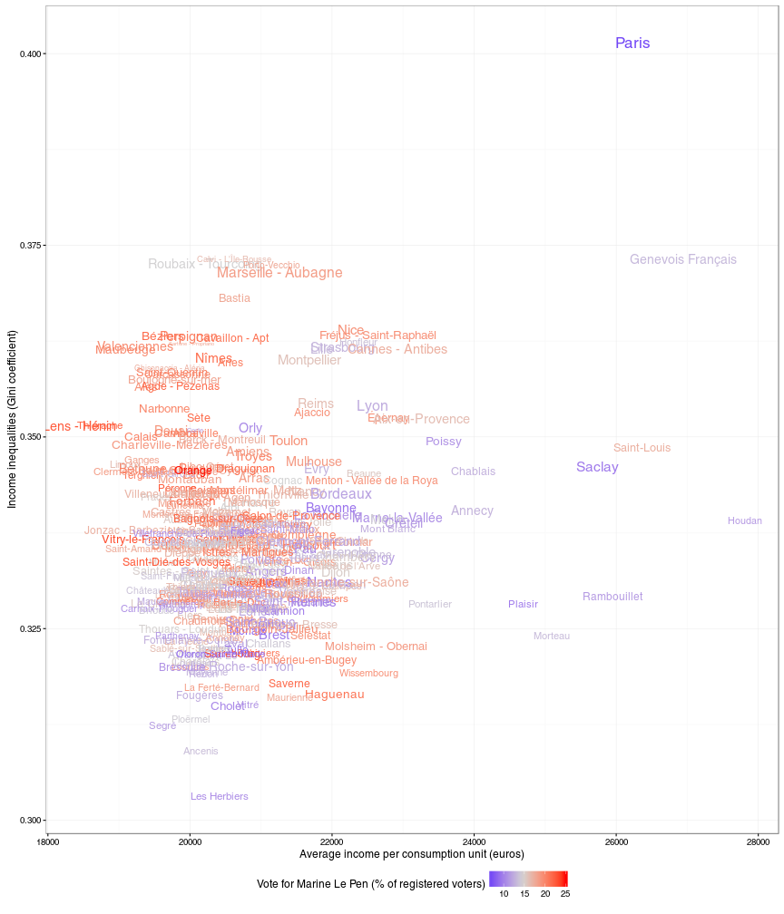
```

## Les inégalités de revenu 

```{r, echo = FALSE, out.width='60%', fig.align='center'}
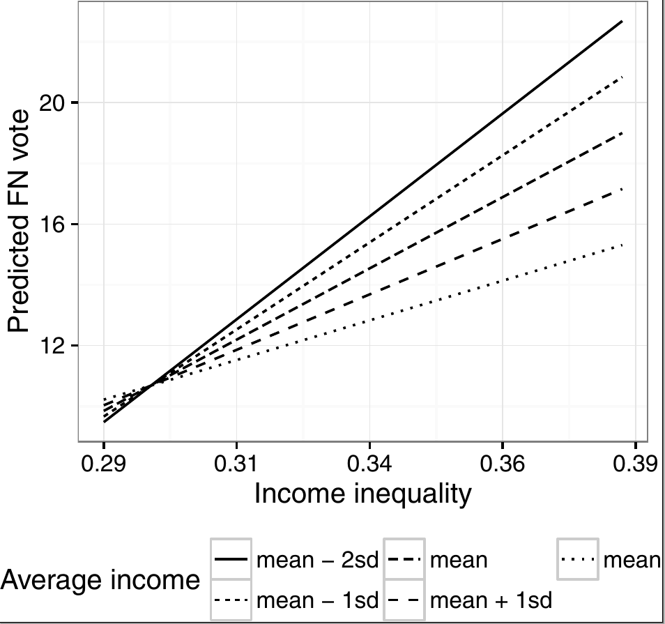
```

## L'offre commerciale et de services

```{r, echo = FALSE, out.width='100%', fig.align='center'}
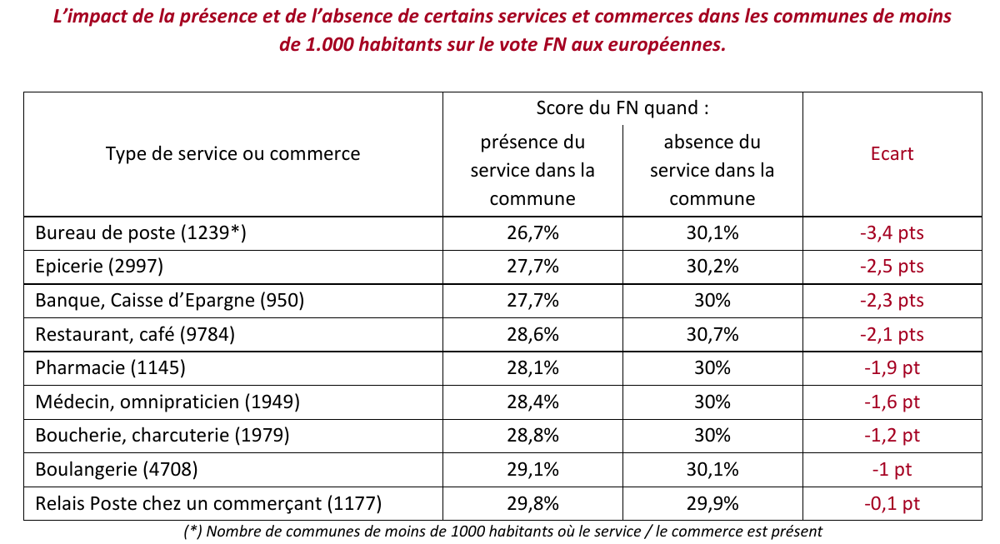
```

<p class="note">Fourquet, 2016</p>

## L'offre commerciale et de services

```{r, echo = FALSE, out.width='80%', fig.align='center'}
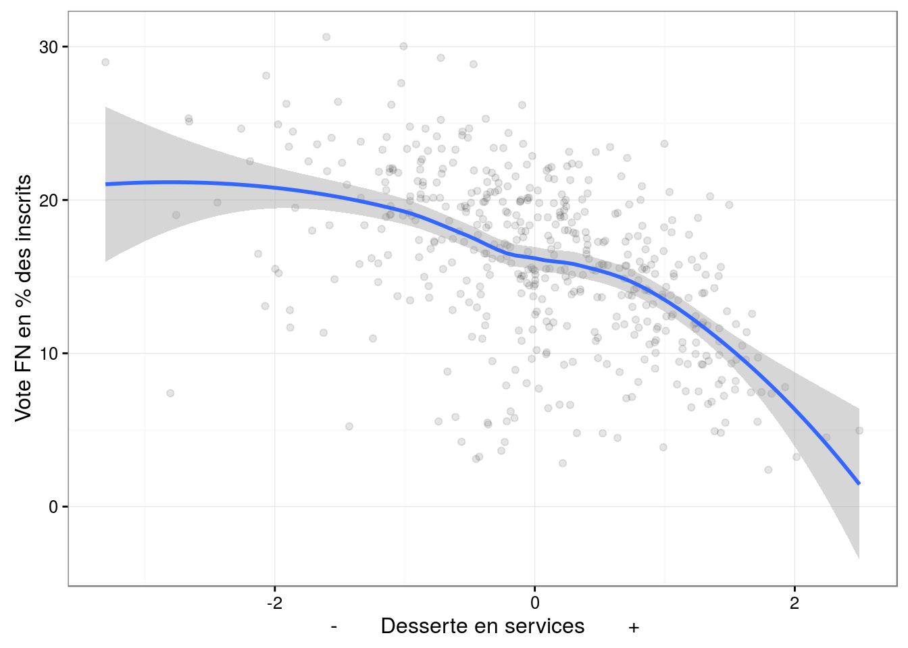
```

<p class="note">À Marseille : Gombin, 2016</p>

## L'offre commerciale et de services

```{r, echo = FALSE, out.width='80%', fig.align='center'}
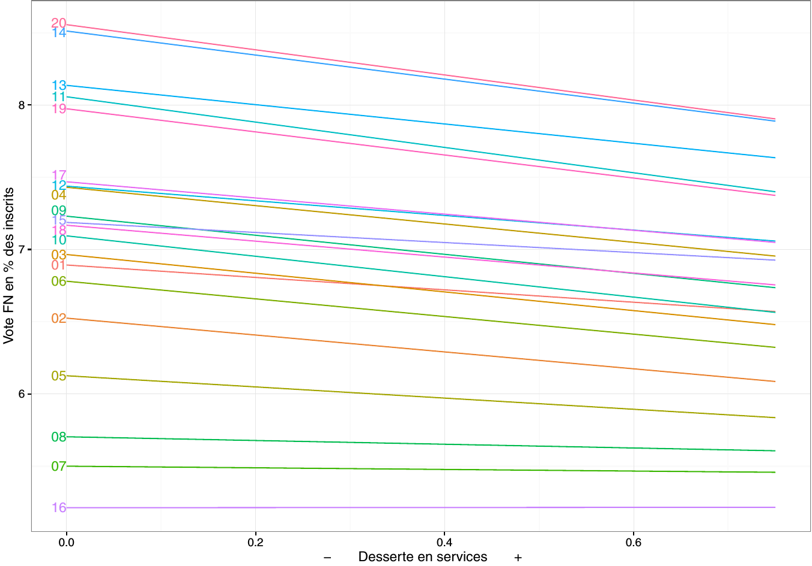
```

<p class="note">À Paris : Gombin, 2016</p>

## L'offre commerciale et de services

```{r, echo = FALSE, out.width='80%', fig.align='center'}

```

<p class="note">À Paris : Gombin, 2016</p>

## L'offre commerciale et de services

À Paris (étude SEMAEST, 2016) : -1,2 point pour FN dans les périmètres d'intervention Vital'Quartier 1 en 2014 et 2015

## Les formes du bâti

```{r, echo = FALSE, out.width='60%', fig.align='center'}
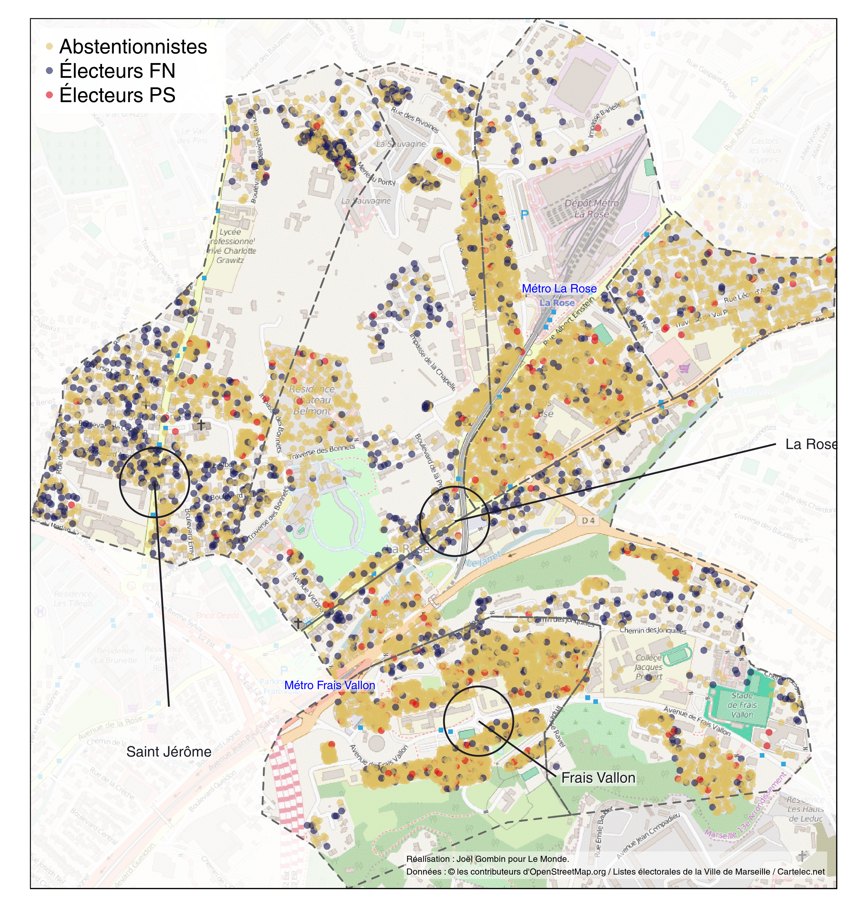
```


# Conclusion

## Conclusion

- un socle important
- en voie de consolidation
- mais qui recèle ses propres tensions, les évolutions sont contrastées

# Merci !